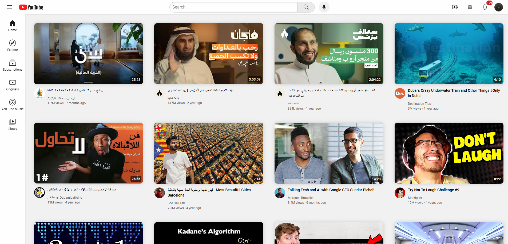

YouTube Clone (HTML + CSS)

A simple YouTube homepage clone built to practice HTML & CSS fundamentals.  
This project was made to strengthen layout, flexbox, grid, and responsive design skills.

Live Demo :  
View it here: [https://n4ww.github.io/youtube-clone/](https://n4ww.github.io/youtube-clone/)

GitHub: [@n4ww](https://github.com/n4ww)
X (Twitter): [@xlirr9](https://x.com/xlirr9)
